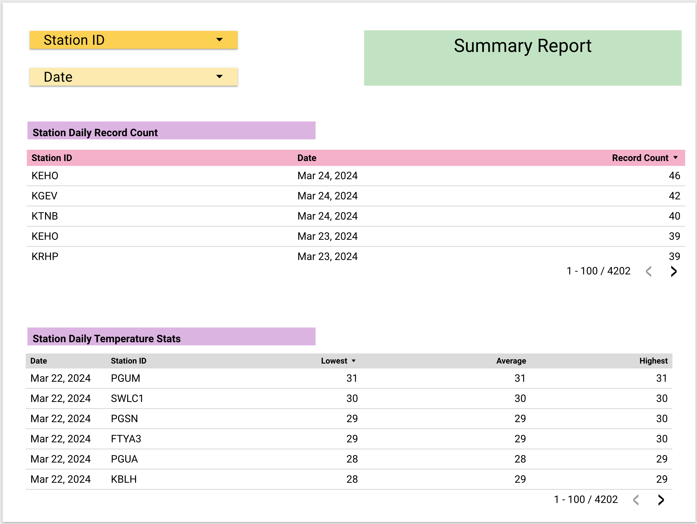
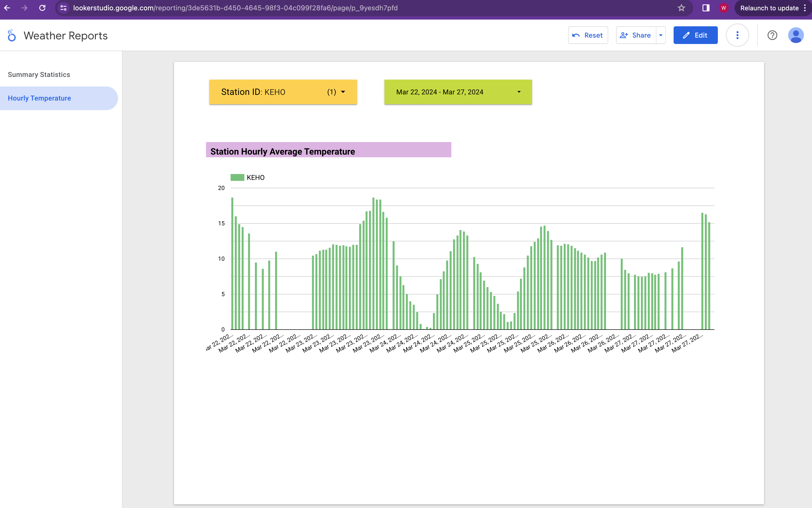

# Data Engineering Zoomcamp 2024 Project

## Overview

This [repository](https://github.com/cch0/data-engineering-zoomcamp-2024-project) contains the source code and documentation for the [Data Engineering Zoomcamp](https://github.com/DataTalksClub/data-engineering-zoomcamp)'s project for 2024.

The content in the README is also available on [https://cch0.github.io/data-engineering-zoomcamp-2024-project/](https://cch0.github.io/data-engineering-zoomcamp-2024-project/)

 

## Goal

The goal of this project is to create a solution which consists an end-to-end batch data ingestion, processing, transformation, persistence and visualization pipeline. With data ingested from National Weathr Service, user will be able to view the hourly temperature data in the report provided by Looker Studio.

 

## Data Source

**National Weather Service**'s [API Web Service](https://www.weather.gov/documentation/services-web-api#/default/radar_station) provides various APIs where we can use to collect real time weather data.

A list of office ids were previously obtained and hard-coded in the data collection Python script (see [weather_data_load.py](./src/weather_data_loader.py))

For each office, we retrieve a list of weather station ids and for each station the Python script makes an API call to obtain current weather data.

 

## Data Collection

Instead of using existing historical data, this project is going to collect data on an hourly basis and build a batch processing pipeline to process them on a daily basis. At the end, data is presented in dashboards built by Google Cloud's Looker Studio.

 

## Data Visualization

The final result is a **Weather Reports** Looker report.

The first page of the report shows the summary statistics. User can select either or both **Station ID** and **Date**.

The first dashboard in this page shows the number of records collected for the selected station and date.

The second dashboard shows the lowest, average and highest temperature for the selected station and date.

 

 

Second page of the report shows the time series temperate data for the selected station and the date range.

 

 

## Data Flow

 

 

## Data Pipelines

 

See [data pipelines](./docs/pipeline.md)

 

## Prerequisites

Before we can execute the pipeline, we would first provision the infrastructure.

**Infrastructure Provisioning**

This includes building Cloud Storage bucket and BigQuery dataset using Terraform.

[infrastructure](./docs/infra.md)

**Docker Container Creation**

This includes building local Mage image as well as running Mage and Postgres containers.

[mage](./docs/mage.md)

 

## Lessons Learned

- Backfill is an important part of the design. Have to take this into consideration when designing the pipeline.
- Deciding on data visualization earlier helps narrowing down the scope and the kind of processing needed for the pipeline. Working backward from the target end state is a useful way to keep things in check.
- Documentation would probably takes as much time as development.

 

## How Is This Website Made?

This website is powered by [Github Page](https://pages.github.com/).

The theme is configured in [_config.yaml](./_config.yaml) file.

 
