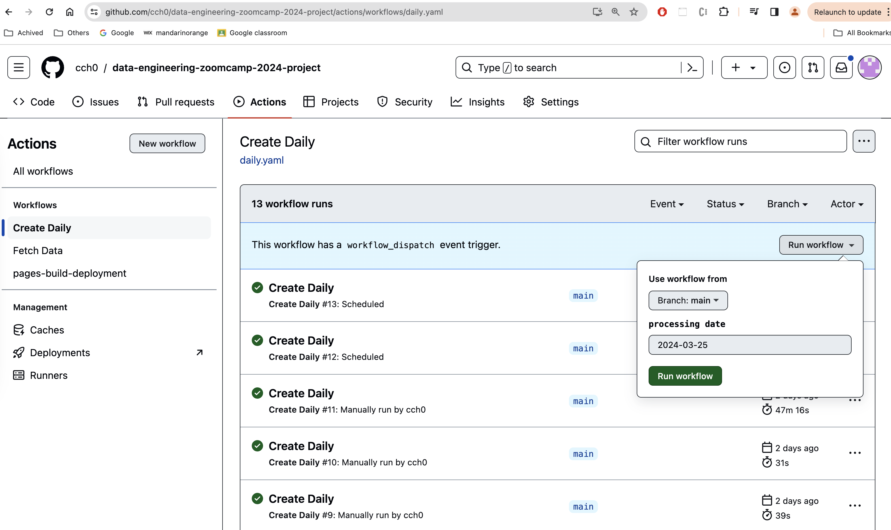
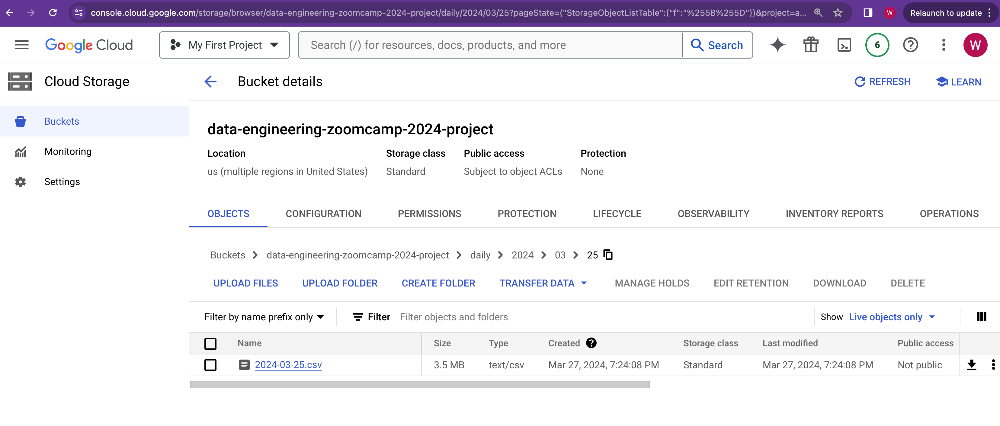
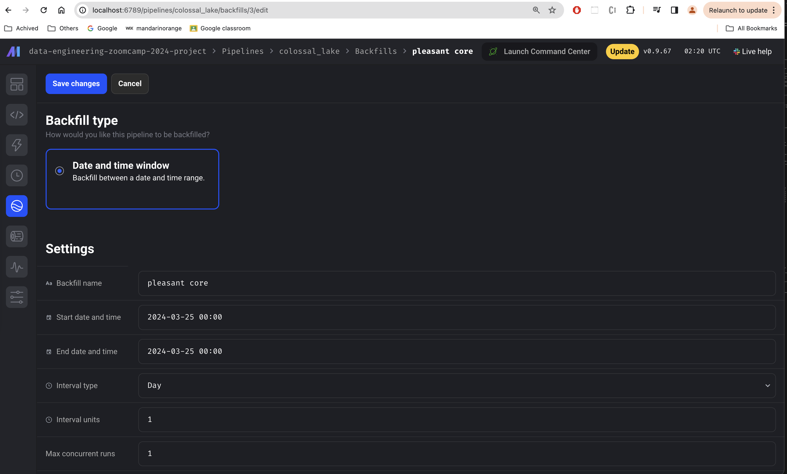
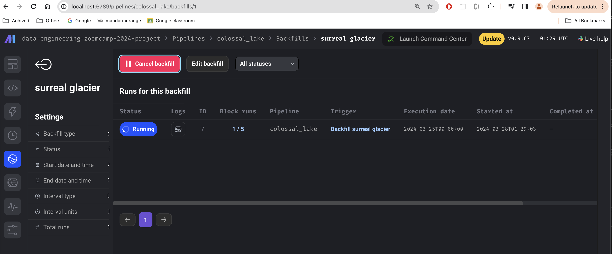
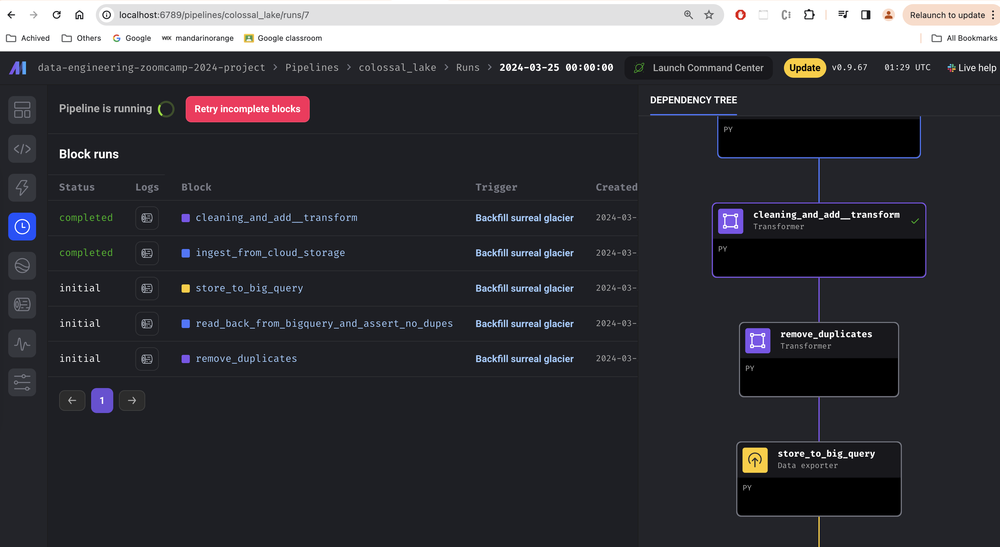
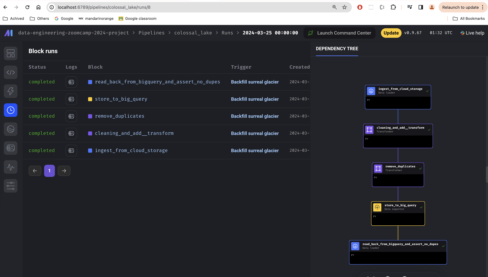
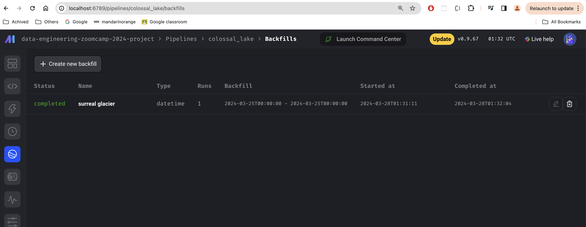

# Backfill

Backfill is a way to "fill the gap" where data is either missing, corrupt or arriving late.

There are two places in the data pipeline where we can apply backfilling.

 

## Github Pipeline Daily Report Backfill

The first place is where we create daily report csv file using Github Pipeline. In the event when we need to re-generate the daily csv file, we can manually trigger a pipeline run for the specific execution date.

 

In the following example, the processing data is `2024-03-25`.

 

 

When pipeline job finished, we can see the csv file landed on GCP Cloud Storage bucket under prefix `daily/2024/03/25`.

 

 

## Mage Backfill

The second place is where we ingest daily csv file into Mage pipeline's Data Loader job called `ingest from cloud storage`.

In the following example, both Start and End date and time are set to `2024-03-25` to backfill the previous day which is `2024-03-24`.

 

 

When pipeline starts running

 

 

Some blocks finished,

 

 

All blocks finished

 

 

Backfill finished successfully

 

 
