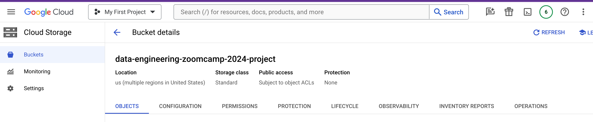
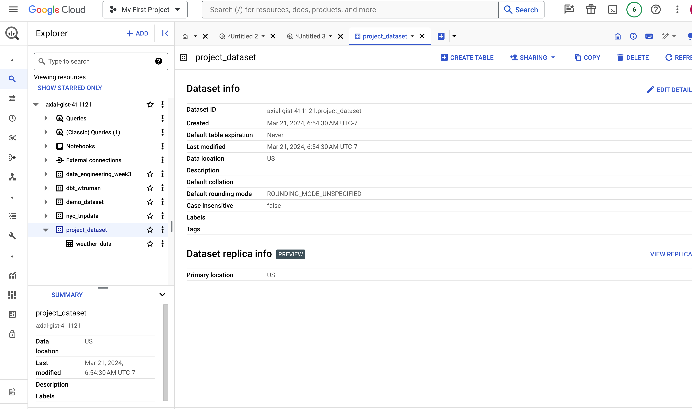

# Infrastructure Provisioning

## Overview

The Google Cloud Storage bucket and Big Query dataset needed for this project are provisioned by Terraform.

## Prerequisites

- GCP Project
- Terraform
- GCP IAM Service Account with the following permissions
    - BigQuery Data Editor
    - BigQuery Job User
    - BigQuery User
    - Storage Admin
- make


<br>

## Provisioning Steps

**Step 0**

Terraform needs GCP credential in order to provision resources. The credential file location is specified in [variables.tf](../terraform/variables.tf)


An example configuration:

```
variable "credentials" {
  description = "GCP Credentials"
  default     = "../application_default_credentials.json"
}
```


<br>

**Step 1**

This step initializes the directory and ready for running Terraform command.


```bash
make tf_init
```


<br>

**Step 2**


This command executes the `terraform plan` command and give us an overview of resources that will be created.


```bash
make tf_plan
```

<br>

<details>
  <summary>Click me</summary>


```

Terraform used the selected providers to generate the following execution plan. Resource actions are indicated with the following symbols:
  + create

Terraform will perform the following actions:

  # google_bigquery_dataset.project_dataset will be created
  + resource "google_bigquery_dataset" "project_dataset" {
      + creation_time              = (known after apply)
      + dataset_id                 = "project_dataset"
      + default_collation          = (known after apply)
      + delete_contents_on_destroy = false
      + effective_labels           = (known after apply)
      + etag                       = (known after apply)
      + id                         = (known after apply)
      + is_case_insensitive        = (known after apply)
      + last_modified_time         = (known after apply)
      + location                   = "US"
      + max_time_travel_hours      = (known after apply)
      + project                    = "axial-gist-411121"
      + self_link                  = (known after apply)
      + storage_billing_model      = (known after apply)
      + terraform_labels           = (known after apply)
    }

  # google_storage_bucket.project-bucket will be created
  + resource "google_storage_bucket" "project-bucket" {
      + effective_labels            = (known after apply)
      + force_destroy               = true
      + id                          = (known after apply)
      + location                    = "US"
      + name                        = "data-engineering-zoomcamp-2024-project"
      + project                     = (known after apply)
      + public_access_prevention    = (known after apply)
      + self_link                   = (known after apply)
      + storage_class               = "STANDARD"
      + terraform_labels            = (known after apply)
      + uniform_bucket_level_access = (known after apply)
      + url                         = (known after apply)

      + lifecycle_rule {
          + action {
              + type = "AbortIncompleteMultipartUpload"
            }
          + condition {
              + age                   = 1
              + matches_prefix        = []
              + matches_storage_class = []
              + matches_suffix        = []
              + with_state            = (known after apply)
            }
        }
    }

Plan: 2 to add, 0 to change, 0 to destroy.

```

</details>


<br>

**Step 3**

This command executes the `terraform apply` command to actually create resources.


```bash
make tf_apply
```


<details>
  <summary>Click me</summary>

```

Terraform used the selected providers to generate the following execution plan. Resource actions are indicated with the following symbols:
  + create

Terraform will perform the following actions:

  # google_bigquery_dataset.project_dataset will be created
  + resource "google_bigquery_dataset" "project_dataset" {
      + creation_time              = (known after apply)
      + dataset_id                 = "project_dataset"
      + default_collation          = (known after apply)
      + delete_contents_on_destroy = false
      + effective_labels           = (known after apply)
      + etag                       = (known after apply)
      + id                         = (known after apply)
      + is_case_insensitive        = (known after apply)
      + last_modified_time         = (known after apply)
      + location                   = "US"
      + max_time_travel_hours      = (known after apply)
      + project                    = "axial-gist-411121"
      + self_link                  = (known after apply)
      + storage_billing_model      = (known after apply)
      + terraform_labels           = (known after apply)
    }

  # google_storage_bucket.project-bucket will be created
  + resource "google_storage_bucket" "project-bucket" {
      + effective_labels            = (known after apply)
      + force_destroy               = true
      + id                          = (known after apply)
      + location                    = "US"
      + name                        = "data-engineering-zoomcamp-2024-project"
      + project                     = (known after apply)
      + public_access_prevention    = (known after apply)
      + self_link                   = (known after apply)
      + storage_class               = "STANDARD"
      + terraform_labels            = (known after apply)
      + uniform_bucket_level_access = (known after apply)
      + url                         = (known after apply)

      + lifecycle_rule {
          + action {
              + type = "AbortIncompleteMultipartUpload"
            }
          + condition {
              + age                   = 1
              + matches_prefix        = []
              + matches_storage_class = []
              + matches_suffix        = []
              + with_state            = (known after apply)
            }
        }
    }

Plan: 2 to add, 0 to change, 0 to destroy.

Do you want to perform these actions?
  Terraform will perform the actions described above.
  Only 'yes' will be accepted to approve.

  Enter a value: yes

google_bigquery_dataset.project_dataset: Creating...
google_storage_bucket.project-bucket: Creating...
google_bigquery_dataset.project_dataset: Creation complete after 1s [id=projects/axial-gist-411121/datasets/project_dataset]
google_storage_bucket.project-bucket: Creation complete after 1s [id=data-engineering-zoomcamp-2024-project]

Apply complete! Resources: 2 added, 0 changed, 0 destroyed.

```

</details>

<br>

**Result**

- A GCP bucket called `data-engineering-zoomcamp-2024-project` has been created.

<br>




- A BigQuery dataset called `project_dataset` has been created.

<br>



<br>


<br>

