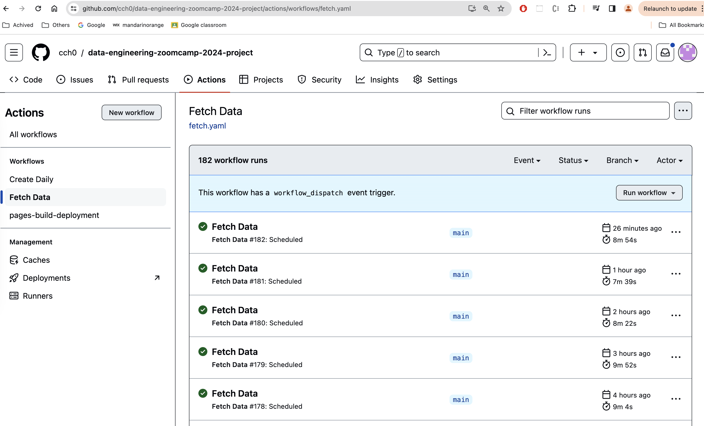
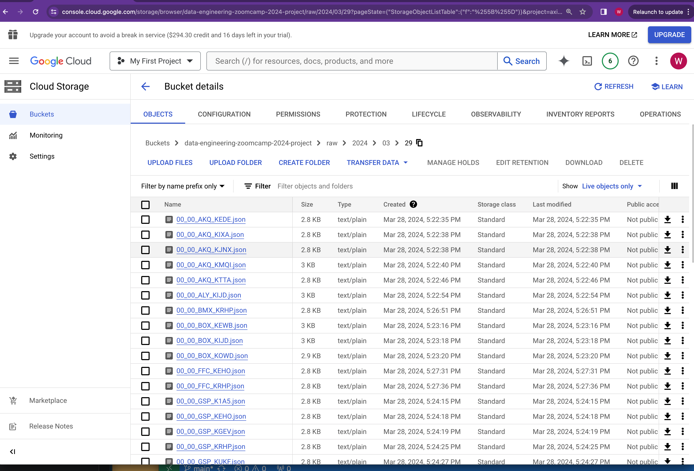
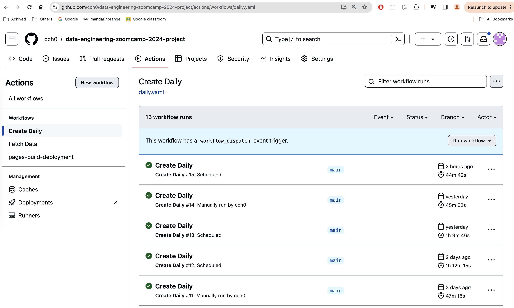

# Data Pipeline

The end-to-end data batch processing pipeline consists of two pieces.

The first pipeline piece is created by using Github Pipeline and second piece is created by using Mage pipeline.

### Github Pipelines

There are two pipeline jobs created for this project.

**Fetch Data**

This [pipline](../.github/workflows/fetch.yaml) is scheduled to run every hour on the dot. When it runs, it executes the [weather data loader](../src/weather_data_loader.py) Python script. The script has a list of hard-coded office ids. For each office id, script retrieves a list of weather station ids and make request to retrieve current weather data from National Weather Service for each station id.

The fetched data will be finally stored as json file in Gloud Storage bucket named `data-engineering-zoomcamp-2024-project` and under the `raw` prefix indicating this is the raw data we collected.

The json file name is partitioned on year, month and day.

 

**Create Daily**

This [pipline](../.github/workflows/daily.yaml) is scheduled to run every day 10 mins before midnight. When it runs, it execute the [transform.py](../src/transform.py) Python script. The script is fetching all the json files from the Cloud Storage bucket based on the provided `execution date`.

When pipeline is a scheduled job, the `execution date` is the current date. When pipeline is kicked off manually, user can enter a particular date as the `execution date`. This would be the backfill scenario.

The downloaded json files will be aggregated together. A transformation process is applied to extract interesting fields and produces a new output object in csv format.

For each execution date, one single csv file will be created and uploaded back to Cloud Storage bucket under the `daily` prefix and paritioned by year, month and day.

 

## Backfill

See [backfill](./backfill.md) for detail explanation of how this solution handles backfilling.

 

