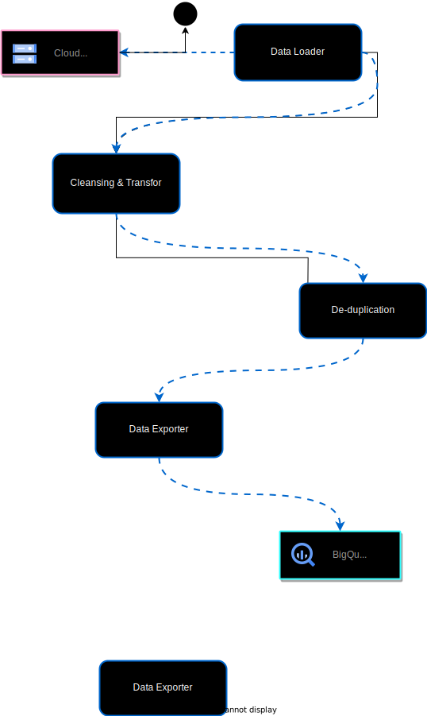

# gcp service account permission


      + dataset_id                 = "project_dataset"
      + default_collation          = (known after apply)
      + delete_contents_on_destroy = false
      + effective_labels           = (known after apply)
      + etag                       = (known after apply)
      + id                         = (known after apply)
      + is_case_insensitive        = (known after apply)
      + last_modified_time         = (known after apply)
      + location                   = "US"
      + max_time_travel_hours      = (known after apply)
      + project                    = "axial-gist-411121"
      + self_link                  = (known after apply)
      + storage_billing_model      = (known after apply)
      + terraform_labels           = (known after apply)
    }

  # google_storage_bucket.project-bucket will be created
  + resource "google_storage_bucket" "project-bucket" {
      + effective_labels            = (known after apply)
      + force_destroy               = true
      + id                          = (known after apply)
      + location                    = "US"
      + name                        = "data-engineering-zoomcamp-2024-project"
      + project                     = (known after apply)
      + public_access_prevention    = (known after apply)
      + self_link                   = (known after apply)
      + storage_class               = "STANDARD"
      + terraform_labels            = (known after apply)
      + uniform_bucket_level_access = (known after apply)
      + url                         = (known after apply)

      + lifecycle_rule {
          + action {
              + type = "AbortIncompleteMultipartUpload"
            }
          + condition {
              + age                   = 1
              + matches_prefix        = []
              + matches_storage_class = []
              + matches_suffix        = []
              + with_state            = (known after apply)
            }
        }
    }

Plan: 2 to add, 0 to change, 0 to destroy.

```

# make tf_apply output


```
Terraform used the selected providers to generate the following execution plan. Resource actions are indicated with the following symbols:
  + create

Terraform will perform the following actions:

  # google_bigquery_dataset.project_dataset will be created
  + resource "google_bigquery_dataset" "project_dataset" {
      + creation_time              = (known after apply)
      + dataset_id                 = "project_dataset"
      + default_collation          = (known after apply)
      + delete_contents_on_destroy = false
      + effective_labels           = (known after apply)
      + etag                       = (known after apply)
      + id                         = (known after apply)
      + is_case_insensitive        = (known after apply)
      + last_modified_time         = (known after apply)
      + location                   = "US"
      + max_time_travel_hours      = (known after apply)
      + project                    = "axial-gist-411121"
      + self_link                  = (known after apply)
      + storage_billing_model      = (known after apply)
      + terraform_labels           = (known after apply)
    }

  # google_storage_bucket.project-bucket will be created
  + resource "google_storage_bucket" "project-bucket" {
      + effective_labels            = (known after apply)
      + force_destroy               = true
      + id                          = (known after apply)
      + location                    = "US"
      + name                        = "data-engineering-zoomcamp-2024-project"
      + project                     = (known after apply)
      + public_access_prevention    = (known after apply)
      + self_link                   = (known after apply)
      + storage_class               = "STANDARD"
      + terraform_labels            = (known after apply)
      + uniform_bucket_level_access = (known after apply)
      + url                         = (known after apply)

      + lifecycle_rule {
          + action {
              + type = "AbortIncompleteMultipartUpload"
            }
          + condition {
              + age                   = 1
              + matches_prefix        = []
              + matches_storage_class = []
              + matches_suffix        = []
              + with_state            = (known after apply)
            }
        }
    }

Plan: 2 to add, 0 to change, 0 to destroy.

Do you want to perform these actions?
  Terraform will perform the actions described above.
  Only 'yes' will be accepted to approve.

  Enter a value: yes

google_bigquery_dataset.project_dataset: Creating...
google_storage_bucket.project-bucket: Creating...
google_bigquery_dataset.project_dataset: Creation complete after 1s [id=projects/axial-gist-411121/datasets/project_dataset]
google_storage_bucket.project-bucket: Creation complete after 1s [id=data-engineering-zoomcamp-2024-project]

Apply complete! Resources: 2 added, 0 changed, 0 destroyed.

```


# mage

## command to build mage image

make mage_build


## output


cd mage && docker compose build ; cd /Users/cch/work/personal/data-engineering-2024-project
WARN[0000] The "PROJECT_NAME" variable is not set. Defaulting to a blank string.
WARN[0000] The "POSTGRES_DBNAME" variable is not set. Defaulting to a blank string.
WARN[0000] The "POSTGRES_SCHEMA" variable is not set. Defaulting to a blank string.
WARN[0000] The "POSTGRES_USER" variable is not set. Defaulting to a blank string.
WARN[0000] The "POSTGRES_PASSWORD" variable is not set. Defaulting to a blank string.
WARN[0000] The "POSTGRES_HOST" variable is not set. Defaulting to a blank string.
WARN[0000] The "POSTGRES_PORT" variable is not set. Defaulting to a blank string.
WARN[0000] The "PROJECT_NAME" variable is not set. Defaulting to a blank string.
WARN[0000] The "POSTGRES_USER" variable is not set. Defaulting to a blank string.
WARN[0000] The "POSTGRES_PASSWORD" variable is not set. Defaulting to a blank string.
WARN[0000] The "POSTGRES_DBNAME" variable is not set. Defaulting to a blank string.
WARN[0000] The "POSTGRES_PORT" variable is not set. Defaulting to a blank string.
[+] Building 41.2s (9/9) FINISHED                                                                                                                         docker:orbstack
 => [magic internal] load build definition from Dockerfile                                                                                                           0.0s
 => => transferring dockerfile: 356B                                                                                                                                 0.0s
 => [magic internal] load metadata for docker.io/mageai/mageai:0.9.67                                                                                                1.9s
 => [magic auth] mageai/mageai:pull token for registry-1.docker.io                                                                                                   0.0s
 => [magic internal] load .dockerignore                                                                                                                              0.0s
 => => transferring context: 2B                                                                                                                                      0.0s
 => [magic internal] load build context                                                                                                                              0.0s
 => => transferring context: 37B                                                                                                                                     0.0s
 => [magic 1/3] FROM docker.io/mageai/mageai:0.9.67@sha256:f6281af217e05006e61e28c82d90a02a1286633b0c45229af8a361c23f1e09fa                                         36.9s
 => => resolve docker.io/mageai/mageai:0.9.67@sha256:f6281af217e05006e61e28c82d90a02a1286633b0c45229af8a361c23f1e09fa                                                0.0s
 => => sha256:f6281af217e05006e61e28c82d90a02a1286633b0c45229af8a361c23f1e09fa 1.61kB / 1.61kB                                                                       0.0s
 => => sha256:c2b9c3ab8fedf30ba32fedec8dfce3594accc9598f40b914d4f5db0411df7fbe 13.82kB / 13.82kB                                                                     0.0s
 => => sha256:ee306797e6b4f06d08eec47acb054cdb7ed94239e7ed83f05cd33a69cb63f993 127.11MB / 127.11MB                                                                   9.3s
 => => sha256:73edd1f16a507f3f9a2c41a54f39d482eae310415e23b30544e373d0f4bf6e57 58.75MB / 58.75MB                                                                     4.1s
 => => sha256:56f35dd1e306f7ce9d2ea213ebec8d8f005d148895f325b2eca89012383bb4c1 2.92MB / 2.92MB                                                                       0.8s
 => => sha256:d2441c8a12e9358c810692615675b44c02c8fa6229faab1610b780a463f55e47 3.36kB / 3.36kB                                                                       0.0s
 => => sha256:0754d28fa2ea610e3967b9cbe435ed0b1eee37d1c795ffe24c72b7651d697e73 338.60MB / 338.60MB                                                                  17.9s
 => => sha256:25c0f3bf7d7886058b4e319020706275ad5600ed9c51a45ed750de2f59b974d2 409B / 409B                                                                           4.3s
 => => extracting sha256:73edd1f16a507f3f9a2c41a54f39d482eae310415e23b30544e373d0f4bf6e57                                                                            0.6s
 => => sha256:71a801d90a9033cc010762d1946c207005e9d05fe9f99941a1ecc81d67dd6fc9 188.56MB / 188.56MB                                                                  15.2s
 => => extracting sha256:56f35dd1e306f7ce9d2ea213ebec8d8f005d148895f325b2eca89012383bb4c1                                                                            0.0s
 => => extracting sha256:ee306797e6b4f06d08eec47acb054cdb7ed94239e7ed83f05cd33a69cb63f993                                                                            8.4s
 => => sha256:7904ab28f8fa04ad78875f83983f2e2538e91a3a67982f257a0e9ef1cd8f7acf 1.04kB / 1.04kB                                                                       9.7s
 => => sha256:e922240b50e76f9835e6872f127c09bf6f6fc4fe74c29fdc663c6093c6720e32 113B / 113B                                                                           9.9s
 => => extracting sha256:0754d28fa2ea610e3967b9cbe435ed0b1eee37d1c795ffe24c72b7651d697e73                                                                            9.3s
 => => extracting sha256:25c0f3bf7d7886058b4e319020706275ad5600ed9c51a45ed750de2f59b974d2                                                                            0.0s
 => => extracting sha256:71a801d90a9033cc010762d1946c207005e9d05fe9f99941a1ecc81d67dd6fc9                                                                            7.6s
 => => extracting sha256:7904ab28f8fa04ad78875f83983f2e2538e91a3a67982f257a0e9ef1cd8f7acf                                                                            0.0s
 => => extracting sha256:e922240b50e76f9835e6872f127c09bf6f6fc4fe74c29fdc663c6093c6720e32                                                                            0.0s
 => [magic 2/3] COPY requirements.txt /home/src/requirements.txt                                                                                                     1.1s
 => [magic 3/3] RUN pip3 install -r /home/src/requirements.txt                                                                                                       1.3s
 => [magic] exporting to image                                                                                                                                       0.0s
 => => exporting layers                                                                                                                                              0.0s
 => => writing image sha256:fb8c18305d56e4c21339adc5942b4d9d72afb90eddcfa2ca98daa734e3871f8e                                                                         0.0s
 => => naming to docker.io/library/mageai:0.9.67


## check mage image

REPOSITORY                                          TAG                              IMAGE ID       CREATED         SIZE
mageai                                              0.9.67                           fb8c18305d56   7 seconds ago   3.36GB


## command to run contains

make mage_up

## output

cd mage && docker compose up -d ; cd /Users/cch/work/personal/data-engineering-2024-project
[+] Running 3/3
 ✔ Network mage_default  Created                                                                                                                                     0.0s
 ✔ Container postgres    Started                                                                                                                                     0.0s
 ✔ Container mage        Started


## docker ps output

CONTAINER ID   IMAGE                      COMMAND                  CREATED          STATUS          PORTS                                                 NAMES
2b83b09465d9   mageai:0.9.67              "mage start data-eng…"   20 seconds ago   Up 19 seconds   0.0.0.0:6789->6789/tcp, :::6789->6789/tcp, 7789/tcp   mage
b7aba071e526   postgres:16.2-alpine3.19   "docker-entrypoint.s…"   20 seconds ago   Up 19 seconds   0.0.0.0:5432->5432/tcp, :::5432->5432/tcp             postgres


## spin down

make mage_down

[+] Running 3/2
 ✔ Container mage        Removed                                                                                                                                    10.2s
 ✔ Container postgres    Removed                                                                                                                                     0.1s
 ✔ Network mage_default  Removed


# ###

bigquery sql to check for duplicate rows

with record_count as (
  SELECT stationId, date, hour, minute, count(*) as count
  FROM `axial-gist-411121.project_dataset.table1`
  group by stationId, date, hour, minute
)
select *
from record_count
where count > 1


# ###




<br>

